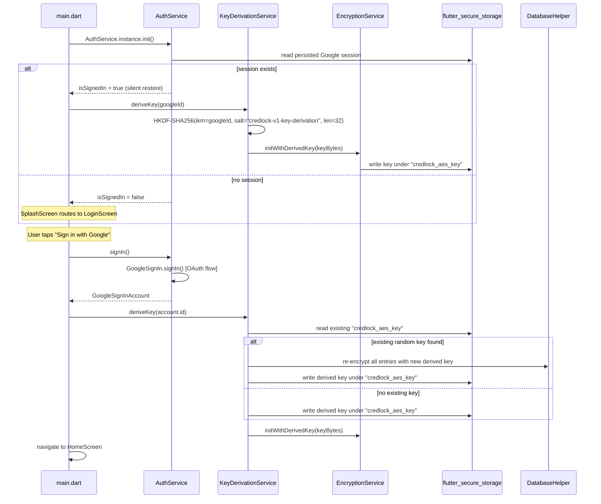
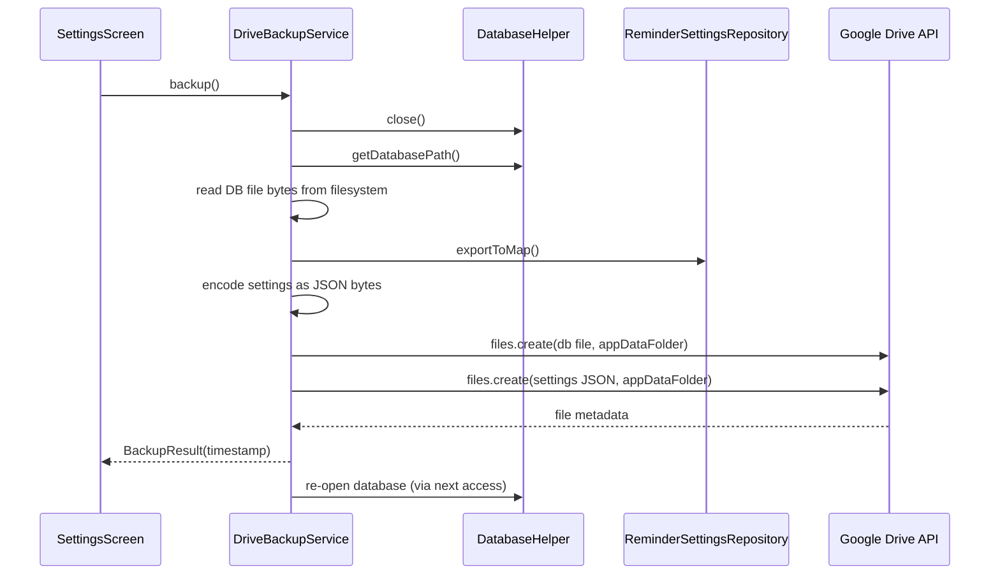
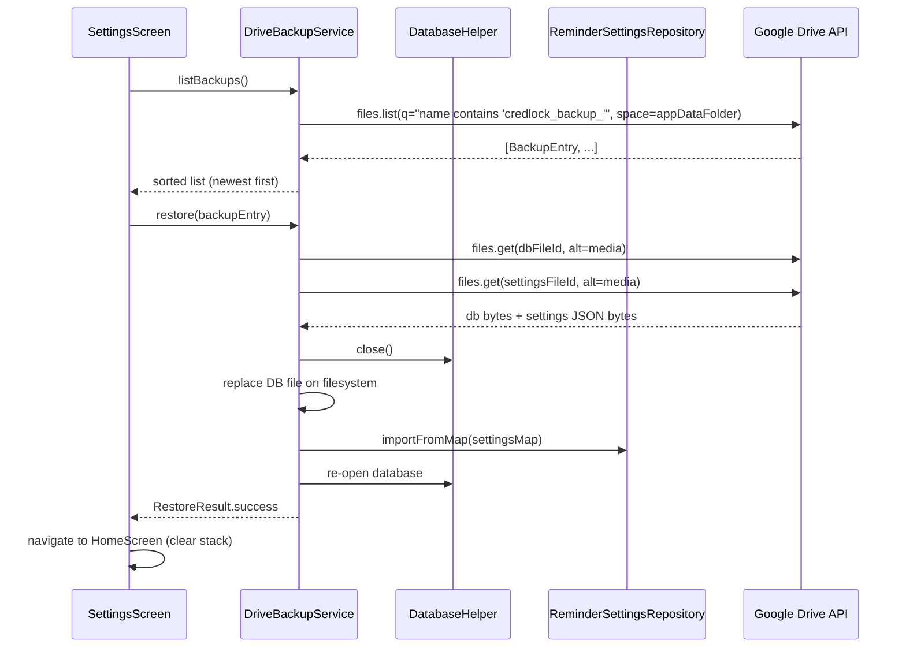

# Design Document: Google Auth & Drive Backup

## Overview

This feature replaces CredLock's placeholder login screen with Google Sign-In (OAuth 2.0), ties the AES-256 encryption key to the user's Google account ID via HKDF-SHA256, and enables encrypted vault backup/restore through the Google Drive `appDataFolder`. The result is a cross-device vault: a user who signs in on a new device can restore their backup and immediately decrypt it because the key is derived deterministically from their Google ID.

### Key Design Decisions

- **Account-bound key derivation over device-bound random key**: The existing random key approach breaks cross-device restore. HKDF-SHA256 from the stable Google account ID produces the same 32-byte key on every device, enabling seamless restore without transmitting the key.
- **`appDataFolder` scope for Drive**: Files stored in `appDataFolder` are invisible to the user in the Drive UI and are automatically deleted when the app is uninstalled. This is the correct scope for app-private backup data.
- **No decryption during backup/restore**: The raw encrypted `.db` file is uploaded and downloaded as-is. The key is never in the backup. This keeps the backup pipeline simple and the security model clean.
- **`googleapis` Dart package over raw HTTP**: The `googleapis` package provides typed Drive API v3 bindings and handles OAuth token injection via `AuthClient`, reducing boilerplate and error surface.

---

## Architecture

The feature adds three new services (`AuthService`, `KeyDerivationService`, `DriveBackupService`) and modifies three existing ones (`EncryptionService`, `DatabaseHelper`, `ReminderSettingsRepository`). The UI layer gains a redesigned `LoginScreen`, an updated `SplashScreen`, and an extended `SettingsScreen`.

### Layer Diagram

```
┌─────────────────────────────────────────────────────────────┐
│                        UI Layer                             │
│  SplashScreen  LoginScreen  SettingsScreen (Account section)│
└────────────────────────┬────────────────────────────────────┘
                         │ calls
┌────────────────────────▼────────────────────────────────────┐
│                     Service Layer                           │
│  AuthService   KeyDerivationService   DriveBackupService    │
│  EncryptionService (updated)                                │
└────────────────────────┬────────────────────────────────────┘
                         │ uses
┌────────────────────────▼────────────────────────────────────┐
│                      Data Layer                             │
│  DatabaseHelper (updated)   ReminderSettingsRepository      │
│  flutter_secure_storage     SharedPreferences               │
└─────────────────────────────────────────────────────────────┘
```

### Sign-In + Key Derivation Sequence



### Backup Sequence



### Restore Sequence



---

## Components and Interfaces

### New: `AuthService`

**Path**: `lib/core/services/auth_service.dart`

Singleton wrapping `google_sign_in`. Manages the OAuth session lifecycle.

```dart
class AuthService {
  static final AuthService instance = AuthService._();
  AuthService._();

  // Initialise at app startup. Silently restores session if available.
  Future<void> init() async { ... }

  // Returns true if a valid session is currently active.
  bool get isSignedIn => _currentUser != null;

  // The signed-in account, or null.
  GoogleSignInAccount? get currentUser => _currentUser;

  // Triggers the Google OAuth consent screen.
  // Returns the account on success, null if cancelled.
  Future<GoogleSignInAccount?> signIn() async { ... }

  // Revokes the local session. Does NOT revoke the OAuth token server-side.
  Future<void> signOut() async { ... }

  // Returns a fresh AuthClient for use with googleapis.
  // Throws StateError if not signed in.
  Future<AuthClient> getAuthClient() async { ... }
}
```

`GoogleSignIn` is configured with scopes:
- `email`
- `profile`
- `https://www.googleapis.com/auth/drive.appdata`

Session persistence is handled automatically by the `google_sign_in` package (stores tokens in platform credential storage).

`getAuthClient()` uses `extension_google_sign_in_as_googleapis_auth` or the `googleapis_auth` approach: obtain `GoogleSignInAuthentication`, then construct an `AccessCredentials`-backed `AuthClient` via `authenticatedClient(http.Client(), credentials)`.

---

### New: `KeyDerivationService`

**Path**: `lib/core/services/key_derivation_service.dart`

Derives the AES-256 key from the Google account ID using HKDF-SHA256. Handles migration from the legacy random key.

```dart
class KeyDerivationService {
  static final KeyDerivationService instance = KeyDerivationService._();
  KeyDerivationService._();

  static const _salt = 'credlock-v1-key-derivation';
  static const _keyAlias = 'credlock_aes_key';

  // Derives a 32-byte key from [googleId] using HKDF-SHA256.
  // Pure function — no side effects.
  Uint8List deriveKey(String googleId) { ... }

  // Derives the key, handles migration if a legacy random key exists,
  // then calls EncryptionService.initWithDerivedKey().
  Future<void> initForAccount(String googleId) async { ... }

  // HKDF extract step: HMAC-SHA256(salt, ikm)
  Uint8List _hkdfExtract(Uint8List salt, Uint8List ikm) { ... }

  // HKDF expand step: produces [length] bytes
  Uint8List _hkdfExpand(Uint8List prk, Uint8List info, int length) { ... }
}
```

**HKDF-SHA256 parameters**:
- IKM (input key material): UTF-8 bytes of the Google account ID
- Salt: UTF-8 bytes of `"credlock-v1-key-derivation"`
- Info: UTF-8 bytes of `"credlock-aes-256-key"`
- Output length: 32 bytes

**Migration logic** in `initForAccount`:
1. Read existing key from `flutter_secure_storage` under `credlock_aes_key`.
2. Derive the new key from `googleId`.
3. If an existing key is found AND it differs from the derived key:
   a. Init `EncryptionService` with the old key.
   b. Load all password entries from `DatabaseHelper`.
   c. Decrypt each entry's `password` and `pin` fields with the old key.
   d. Re-encrypt each field with the new derived key.
   e. Write updated entries back to the database.
   f. Store the new derived key in `flutter_secure_storage`.
4. If no existing key, or the existing key already matches the derived key: store the derived key and proceed.
5. Call `EncryptionService.initWithDerivedKey(derivedKeyBytes)`.

---

### New: `DriveBackupService`

**Path**: `lib/core/services/drive_backup_service.dart`

Handles all Google Drive interactions for backup and restore.

```dart
class DriveBackupService {
  static final DriveBackupService instance = DriveBackupService._();
  DriveBackupService._();

  // Uploads current DB + settings to appDataFolder.
  // Returns the UTC timestamp string used in the filenames.
  Future<String> backup() async { ... }

  // Lists available backup bundles, sorted newest first.
  Future<List<BackupEntry>> listBackups() async { ... }

  // Downloads and applies the selected backup.
  Future<void> restore(BackupEntry entry) async { ... }

  // Formats a DateTime to the backup filename timestamp: YYYYMMDDTHHmmssZ
  String _formatTimestamp(DateTime utc) { ... }

  // Parses a backup filename to extract the UTC DateTime.
  DateTime? _parseTimestamp(String filename) { ... }
}

class BackupEntry {
  final String timestamp;       // e.g. "20250115T143022Z"
  final DateTime utcDateTime;   // parsed from timestamp
  final String dbFileId;        // Drive file ID for the .db file
  final String settingsFileId;  // Drive file ID for the _settings.json file
  final String displayLabel;    // human-readable local date/time string
}
```

**Drive API usage**:
- Uses `DriveApi` from `package:googleapis/drive/v3.dart`
- `AuthClient` obtained from `AuthService.instance.getAuthClient()`
- Upload: `driveApi.files.create(file, uploadMedia: Media(stream, length))` with `parents: ['appDataFolder']`
- List: `driveApi.files.list(q: "name contains 'credlock_backup_'", spaces: 'appDataFolder', fields: 'files(id,name,createdTime)')`
- Download: `driveApi.files.get(fileId, downloadOptions: DownloadOptions.fullMedia)` cast to `Media`

---

### Updated: `EncryptionService`

Add `initWithDerivedKey` alongside the existing `init()`:

```dart
/// Initialise with a caller-supplied 32-byte key.
/// Used after Google Sign-In key derivation.
Future<void> initWithDerivedKey(Uint8List keyBytes) async {
  assert(keyBytes.length == 32, 'Key must be 32 bytes');
  final key = Key(keyBytes);
  _encrypter = Encrypter(AES(key, mode: AESMode.cbc));
  // Persist so the key survives app restarts (read back by AuthService.init)
  final encoded = base64Url.encode(keyBytes);
  await _secureStorage.write(key: _keyAlias, value: encoded);
  _ready = true;
}
```

The existing `init()` is kept for backward compatibility during the migration window (it is called by `KeyDerivationService` when re-encrypting with the old key). After migration, `main.dart` no longer calls `init()` directly.

---

### Updated: `DatabaseHelper`

Add two methods:

```dart
/// Returns the full filesystem path to the database file.
Future<String> getDatabasePath() async {
  final dbPath = await getDatabasesPath();
  return join(dbPath, _dbName);
}

/// Closes the database connection. Must be called before file-level
/// operations (backup copy, restore replace).
Future<void> close() async {
  await _db?.close();
  _db = null;
}
```

---

### Updated: `ReminderSettingsRepository`

Add export/import methods to the abstract interface and the `SharedPrefsReminderSettingsRepository` implementation:

```dart
// In the abstract interface:
Future<Map<String, dynamic>> exportToMap();
Future<void> importFromMap(Map<String, dynamic> map);

// Implementation:
@override
Future<Map<String, dynamic>> exportToMap() async {
  final prefs = await SharedPreferences.getInstance();
  return {
    'reminder_enabled': prefs.getBool(_keyEnabled),
    'reminder_frequency': prefs.getString(_keyFrequency),
    'reminder_last_notified_date': prefs.getString(_keyLastNotified),
  };
}

@override
Future<void> importFromMap(Map<String, dynamic> map) async {
  final prefs = await SharedPreferences.getInstance();
  final enabled = map['reminder_enabled'];
  final frequency = map['reminder_frequency'];
  final lastNotified = map['reminder_last_notified_date'];
  if (enabled != null) await prefs.setBool(_keyEnabled, enabled as bool);
  if (frequency != null) await prefs.setString(_keyFrequency, frequency as String);
  if (lastNotified != null) {
    await prefs.setString(_keyLastNotified, lastNotified as String);
  } else {
    await prefs.remove(_keyLastNotified);
  }
}
```

---

## Data Models

### `BackupEntry`

```dart
class BackupEntry {
  final String timestamp;       // "20250115T143022Z"
  final DateTime utcDateTime;
  final String dbFileId;
  final String settingsFileId;
  final String displayLabel;    // formatted for UI, e.g. "Jan 15, 2025 2:30 PM"
}
```

### Settings Snapshot JSON Schema

```json
{
  "reminder_enabled": true,
  "reminder_frequency": "1_month",
  "reminder_last_notified_date": "2025-01-10T00:00:00.000"
}
```

All three keys are always present. `reminder_last_notified_date` may be `null`.

### Backup File Naming

| File | Pattern | Example |
|------|---------|---------|
| Database | `credlock_backup_<YYYYMMDDTHHmmss>Z.db` | `credlock_backup_20250115T143022Z.db` |
| Settings | `credlock_backup_<YYYYMMDDTHHmmss>Z_settings.json` | `credlock_backup_20250115T143022Z_settings.json` |

The timestamp is UTC. Both files in a bundle share the same timestamp prefix, enabling them to be paired during restore.

### `GoogleSignInAccount` (from `google_sign_in`)

Used directly — no wrapper model needed. Relevant fields:
- `id`: stable Google account ID (used as HKDF IKM)
- `displayName`: shown in Account section
- `email`: shown in Account section
- `photoUrl`: used for avatar; may be null

---

## Platform Setup

### Android

1. **Firebase / Google Cloud project**: Register the app in Google Cloud Console (or Firebase). Download `google-services.json` and place it at `android/app/google-services.json`.

2. **`android/settings.gradle.kts`** — add the Google Services plugin:
   ```kotlin
   plugins {
       // existing plugins...
       id("com.google.gms.google-services") version "4.4.2" apply false
   }
   ```

3. **`android/app/build.gradle.kts`** — apply the plugin:
   ```kotlin
   plugins {
       // existing plugins...
       id("com.google.gms.google-services")
   }
   ```

4. **SHA-1 fingerprint**: The OAuth client ID in `google-services.json` must be registered with the debug and release SHA-1 fingerprints. Obtain with:
   ```
   keytool -list -v -keystore ~/.android/debug.keystore -alias androiddebugkey -storepass android -keypass android
   ```

5. **`minSdk`**: `google_sign_in` requires `minSdk = 21`. The current `flutter.minSdkVersion` should be verified to be ≥ 21.

### iOS

1. **Google Cloud project**: Download `GoogleService-Info.plist` and add it to `ios/Runner/` in Xcode (ensure it is included in the Runner target).

2. **`ios/Runner/Info.plist`** — add the reversed client ID as a URL scheme:
   ```xml
   <key>CFBundleURLTypes</key>
   <array>
     <dict>
       <key>CFBundleTypeRole</key>
       <string>Editor</string>
       <key>CFBundleURLSchemes</key>
       <array>
         <!-- Replace with REVERSED_CLIENT_ID from GoogleService-Info.plist -->
         <string>com.googleusercontent.apps.YOUR_CLIENT_ID</string>
       </array>
     </dict>
   </array>
   ```

3. **`ios/Runner/AppDelegate.swift`** — no changes needed; `google_sign_in` handles the URL callback via its Flutter plugin.

---

## New Dependencies

Add to `pubspec.yaml`:

```yaml
dependencies:
  google_sign_in: ^6.2.2
  googleapis: ^13.2.0
  googleapis_auth: ^1.6.0
  crypto: ^3.0.6
```

`crypto` provides `Hmac` and `sha256` for the HKDF implementation. `googleapis_auth` provides `AuthClient` and `authenticatedClient`. `googleapis` provides the typed Drive API v3 bindings.

---

## App Startup Flow Changes

### Before (current `main.dart`)

```dart
await EncryptionService.instance.init();  // generates/reads random key
```

### After

```dart
await AuthService.instance.init();  // silently restores Google session if available
// If session restored: AuthService.init() calls KeyDerivationService.initForAccount()
//   which calls EncryptionService.initWithDerivedKey()
// If no session: EncryptionService remains uninitialised until after sign-in
```

`EncryptionService.init()` is **not** called from `main.dart` anymore. The encryption service is only initialised after a Google account is confirmed (either via silent restore or interactive sign-in). This means the `DatabaseHelper` must not be accessed before `EncryptionService` is ready — which is already guaranteed because the vault is only reachable from `HomeScreen`, which is only navigated to after sign-in.

---

## SplashScreen Changes

After the animation completes, replace the unconditional `HomeScreen` navigation with:

```dart
if (AuthService.instance.isSignedIn) {
  // navigate to HomeScreen
} else {
  // navigate to LoginScreen
}
```

`AuthService.isSignedIn` is synchronous (reads an in-memory field set during `AuthService.init()`), so there is no additional async delay after the animation.

---

## LoginScreen Redesign

The existing email/password form is replaced entirely. The new screen:

- Keeps the existing logo, app name, and orange blob background aesthetic
- Shows a single "Sign in with Google" button styled to match the app's dark theme (white text on dark surface with Google logo icon)
- Shows a `CircularProgressIndicator` in place of the button while sign-in is in progress
- Shows a `SnackBar` with the error message if sign-in fails
- Does nothing (no error) if the user cancels the OAuth flow

```dart
class _LoginScreenState extends State<LoginScreen> {
  bool _loading = false;
  String? _error;

  Future<void> _handleSignIn() async {
    setState(() { _loading = true; _error = null; });
    try {
      final account = await AuthService.instance.signIn();
      if (account == null) {
        // User cancelled — no error shown
        setState(() { _loading = false; });
        return;
      }
      await KeyDerivationService.instance.initForAccount(account.id);
      if (!mounted) return;
      Navigator.of(context).pushReplacement(
        MaterialPageRoute(builder: (_) => const HomeScreen()),
      );
    } catch (e) {
      setState(() { _loading = false; _error = e.toString(); });
    }
  }
}
```

---

## SettingsScreen Changes

A new `_AccountSection` widget is inserted above the existing `PASSWORD REMINDERS` section. It is built from the signed-in `GoogleSignInAccount` obtained from `AuthService.instance.currentUser`.

### Account Section Layout

```
┌─────────────────────────────────────────────┐
│  ACCOUNT                                    │
│ ┌─────────────────────────────────────────┐ │
│ │  [Avatar]  Display Name                 │ │
│ │            email@gmail.com              │ │
│ ├─────────────────────────────────────────┤ │
│ │  ☁  Backup to Google Drive      [>]    │ │
│ ├─────────────────────────────────────────┤ │
│ │  ↓  Restore from Google Drive   [>]    │ │
│ ├─────────────────────────────────────────┤ │
│ │  ⎋  Sign Out                    [>]    │ │
│ └─────────────────────────────────────────┘ │
└─────────────────────────────────────────────┘
```

**Avatar**: `CircleAvatar` with `NetworkImage(photoUrl)` if available; falls back to initials text if `photoUrl` is null or the image fails to load.

**Backup tile**: Tapping triggers `DriveBackupService.instance.backup()`. Shows a `CircularProgressIndicator` in the tile while in progress. Disabled while backup or restore is running.

**Restore tile**: Tapping opens a `DraggableScrollableSheet` bottom sheet that calls `DriveBackupService.instance.listBackups()` and displays the results. Each entry shows the human-readable timestamp. Tapping an entry shows a confirmation `AlertDialog` before calling `DriveBackupService.instance.restore(entry)`.

**Sign Out tile**: Tapping shows a confirmation `AlertDialog`. On confirm, calls `AuthService.instance.signOut()` then navigates to `LoginScreen` with `pushAndRemoveUntil`.

---

## Google Drive API Usage Details

### Authentication

```dart
final authClient = await AuthService.instance.getAuthClient();
final driveApi = DriveApi(authClient);
```

`getAuthClient()` implementation:
```dart
Future<AuthClient> getAuthClient() async {
  final auth = await _googleSignIn.currentUser!.authentication;
  final credentials = AccessCredentials(
    AccessToken('Bearer', auth.accessToken!, DateTime.now().toUtc().add(const Duration(hours: 1))),
    auth.idToken,
    ['https://www.googleapis.com/auth/drive.appdata'],
  );
  return authenticatedClient(http.Client(), credentials);
}
```

### Upload (Backup)

```dart
final timestamp = _formatTimestamp(DateTime.now().toUtc());
final dbBytes = await File(dbPath).readAsBytes();
final dbMedia = Media(Stream.value(dbBytes), dbBytes.length, contentType: 'application/octet-stream');
final dbFile = drive.File()
  ..name = 'credlock_backup_${timestamp}Z.db'
  ..parents = ['appDataFolder'];
await driveApi.files.create(dbFile, uploadMedia: dbMedia);
```

### List Backups

```dart
final result = await driveApi.files.list(
  q: "name contains 'credlock_backup_' and name contains '.db'",
  spaces: 'appDataFolder',
  $fields: 'files(id,name)',
);
```

Only `.db` files are listed (one per bundle). The corresponding `_settings.json` file is found by replacing `.db` with `_settings.json` in the name, then doing a second `files.list` with that exact name, or by listing all `credlock_backup_` files and pairing by timestamp prefix.

### Download (Restore)

```dart
final media = await driveApi.files.get(
  fileId,
  downloadOptions: DownloadOptions.fullMedia,
) as Media;
final bytes = await consolidateHttpClientResponseBytes(media.stream);
```

---

## Error Handling

| Scenario | Handling |
|----------|----------|
| Google sign-in cancelled | `signIn()` returns `null`; LoginScreen stays visible, no error shown |
| Google sign-in network error | `signIn()` throws; LoginScreen shows error SnackBar |
| Silent session restore fails | `AuthService.init()` catches silently; `isSignedIn` remains false; SplashScreen routes to LoginScreen |
| Backup Drive API error | `DriveBackupService.backup()` throws; SettingsScreen shows error SnackBar; existing Drive files unchanged |
| Restore download error | `DriveBackupService.restore()` throws before file replacement; on-device DB and SharedPreferences unchanged |
| Restore file replacement error | Caught; user shown error; DB may be in inconsistent state — user is advised to retry |
| Key derivation migration error | `KeyDerivationService.initForAccount()` throws; sign-in fails with error; old key remains in secure storage |
| Sign-out while backup in progress | Sign-out tile is disabled while backup/restore is running |
| Different account signs in | `KeyDerivationService.initForAccount()` detects account ID mismatch, clears vault data, derives new key |

All async operations in the UI use `try/catch` and surface errors via `ScaffoldMessenger.of(context).showSnackBar(...)`. Progress states are tracked with `setState` boolean flags (`_backupInProgress`, `_restoreInProgress`).

---

## Testing Strategy

### Unit Tests

- `KeyDerivationService.deriveKey(googleId)`: verify determinism (same input → same output), isolation (different inputs → different outputs), output length (32 bytes).
- `DriveBackupService._formatTimestamp` / `_parseTimestamp`: verify round-trip correctness and edge cases (midnight, end of year).
- `ReminderSettingsRepository.exportToMap` / `importFromMap`: verify all keys are preserved, null `lastNotifiedDate` is handled.
- `EncryptionService.initWithDerivedKey`: verify that encrypt/decrypt round-trips work after initialisation with a known key.

### Property-Based Tests

See Correctness Properties section below. Use `package:test` with a property-based testing library (e.g., `dart_test` with manual generators, or `glados` for Dart).

### Integration Tests

- Full sign-in flow on a device/emulator with a real Google account (manual or using Firebase Test Lab).
- Backup and restore against a real Drive `appDataFolder` (manual smoke test).
- Migration: install old build (random key), upgrade to new build, verify vault is accessible after sign-in.

### Widget Tests

- `LoginScreen`: verify Google Sign-In button is present, loading state replaces button, error SnackBar appears on failure.
- `SettingsScreen`: verify Account section appears above Password Reminders, tiles are disabled during backup/restore.


---

## Correctness Properties

*A property is a characteristic or behavior that should hold true across all valid executions of a system — essentially, a formal statement about what the system should do. Properties serve as the bridge between human-readable specifications and machine-verifiable correctness guarantees.*

### Property 1: Key Derivation Determinism and Length

*For any* non-empty Google account ID string, `KeyDerivationService.deriveKey(id)` SHALL always return exactly 32 bytes, and calling it a second time with the same ID SHALL return a byte-for-byte identical result.

**Validates: Requirements 9.1, 9.2**

---

### Property 2: Key Derivation Isolation

*For any* two distinct Google account ID strings, `KeyDerivationService.deriveKey()` SHALL produce different 32-byte outputs.

**Validates: Requirements 9.6**

---

### Property 3: Migration Round-Trip

*For any* non-empty list of plaintext password entry strings, encrypting each with a randomly generated key, then running the migration procedure (re-encrypting with the HKDF-derived key for a given Google ID), then decrypting each with the derived key SHALL produce the original plaintext strings.

**Validates: Requirements 9.4**

---

### Property 4: Settings Export/Import Round-Trip

*For any* combination of `reminder_enabled` (bool), `reminder_frequency` (valid storage key string), and `reminder_last_notified_date` (ISO-8601 string or null), calling `exportToMap()` after `importFromMap(map)` SHALL return a map with values equal to the original map for all three keys.

**Validates: Requirements 5.3, 7.3**

---

### Property 5: Backup Filename Timestamp Round-Trip

*For any* UTC `DateTime` (truncated to whole seconds), formatting it with `_formatTimestamp` and then parsing the resulting filename with `_parseTimestamp` SHALL return a `DateTime` equal to the original.

**Validates: Requirements 5.4**

---

### Property 6: Backup Data Integrity

*For any* byte sequence read from the database file, the bytes passed to the Drive upload call SHALL be identical to the bytes read from the filesystem; and for any byte sequence downloaded from Drive during restore, the bytes written to the database file path SHALL be identical to the downloaded bytes.

**Validates: Requirements 5.8, 7.7**

---

### Property 7: Backup List Sort Order

*For any* non-empty list of `BackupEntry` objects with distinct `utcDateTime` values, `DriveBackupService.listBackups()` SHALL return them ordered such that each entry's `utcDateTime` is greater than or equal to the next entry's `utcDateTime` (descending / newest first).

**Validates: Requirements 6.1**

---

### Property 8: Account Section Displays User Profile

*For any* `GoogleSignInAccount` with a non-null `displayName` and `email`, rendering the Account section widget SHALL produce a widget tree that contains both the display name string and the email string as visible text.

**Validates: Requirements 3.2, 8.2**
