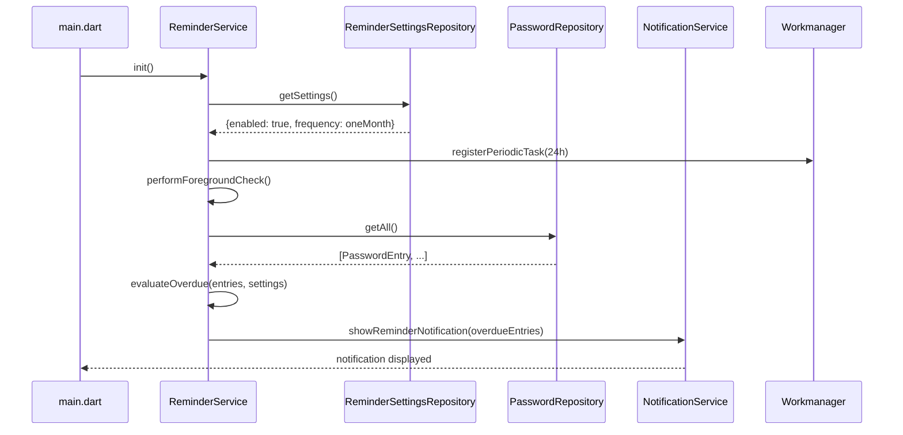

# Design Document: Password Change Reminder

## Overview

The Password Change Reminder feature adds proactive security hygiene to CredLock by evaluating the age of each stored password entry and delivering local notifications when entries are overdue for a change. Users configure the feature through a new `SettingsScreen` that replaces the existing placeholder in the Settings tab.

The feature introduces three new services (`ReminderSettingsRepository`, `NotificationService`, `ReminderService`), two new dependencies (`flutter_local_notifications`, `shared_preferences`), one background-task dependency (`workmanager`), a model field addition (`lastUpdatedAt` on `PasswordEntry`), and a database migration (version 2 → 3).

### Key Design Decisions

- **Age is measured from `lastUpdatedAt`, not `createdAt`.** This ensures the reminder timer resets whenever a password is actually changed, not just when the entry was first created.
- **Month arithmetic uses calendar months, not fixed-day approximations.** Adding one calendar month to January 31 yields February 28/29, matching user expectations.
- **Day-level precision only.** Time-of-day is stripped before any comparison so that a password updated at 11 PM is not considered overdue the next morning.
- **A single fixed notification ID is used for all reminder notifications.** This means each new check replaces the previous notification rather than stacking duplicates.
- **`workmanager` handles Android background scheduling; iOS uses BGTaskScheduler via the same plugin.** iOS background execution is best-effort and subject to OS throttling.

---

## Architecture

The feature fits into the existing layered architecture without restructuring it:

```
┌─────────────────────────────────────────────────────────┐
│                        UI Layer                         │
│  lib/features/settings/settings_screen.dart             │
│  (replaces _PlaceholderScreen in HomeScreen)            │
└────────────────────────┬────────────────────────────────┘
                         │ reads/writes
┌────────────────────────▼────────────────────────────────┐
│                     Service Layer                       │
│  lib/core/services/reminder_service.dart                │
│  lib/core/services/notification_service.dart            │
└──────────┬──────────────────────────┬───────────────────┘
           │ reads settings           │ reads passwords
┌──────────▼──────────┐  ┌───────────▼───────────────────┐
│  ReminderSettings   │  │      PasswordRepository        │
│  Repository         │  │  (existing, updated update())  │
│  shared_preferences │  │  sqflite / DatabaseHelper v3   │
└─────────────────────┘  └───────────────────────────────┘
           │
┌──────────▼──────────┐
│  NotificationService│
│  flutter_local_     │
│  notifications      │
└─────────────────────┘
           │ schedules
┌──────────▼──────────┐
│  workmanager        │
│  (background tasks) │
└─────────────────────┘
```

### Component Interaction Flow



---

## New Dependencies

Add the following to `pubspec.yaml` under `dependencies`:

```yaml
flutter_local_notifications: ^18.0.1
shared_preferences: ^2.3.5
workmanager: ^0.9.0
```

### Android Setup Required

`flutter_local_notifications` version 10+ requires desugaring support. Add to `android/app/build.gradle.kts`:

```kotlin
android {
    defaultConfig {
        multiDexEnabled = true
    }
    compileOptions {
        isCoreLibraryDesugaringEnabled = true
        sourceCompatibility = JavaVersion.VERSION_17
        targetCompatibility = JavaVersion.VERSION_17
    }
}

dependencies {
    coreLibraryDesugaring("com.android.tools:desugar_jdk_libs:2.1.4")
}
```

Add notification permissions to `android/app/src/main/AndroidManifest.xml`:

```xml
<uses-permission android:name="android.permission.POST_NOTIFICATIONS"/>
<uses-permission android:name="android.permission.RECEIVE_BOOT_COMPLETED"/>
<uses-permission android:name="android.permission.SCHEDULE_EXACT_ALARM" />
```

### iOS Setup Required

Add to `ios/Runner/AppDelegate.swift`:

```swift
import flutter_local_notifications

@UIApplicationMain
@objc class AppDelegate: FlutterAppDelegate {
  override func application(
    _ application: UIApplication,
    didFinishLaunchingWithOptions launchOptions: [UIApplication.LaunchOptionsKey: Any]?
  ) -> Bool {
    FlutterLocalNotificationsPlugin.setPluginRegistrantCallback { registry in
      GeneratedPluginRegistrant.register(with: registry)
    }
    // Required for background fetch
    if #available(iOS 10.0, *) {
      UNUserNotificationCenter.current().delegate = self as? UNUserNotificationCenterDelegate
    }
    return super.application(application, didFinishLaunchingWithOptions: launchOptions)
  }
}
```

Add to `ios/Runner/Info.plist` for workmanager background tasks:

```xml
<key>BGTaskSchedulerPermittedIdentifiers</key>
<array>
    <string>be.tramckrijte.workmanagerExample.iOSBackgroundAppRefresh</string>
</array>
<key>UIBackgroundModes</key>
<array>
    <string>fetch</string>
    <string>processing</string>
</array>
```

---

## Components and Interfaces

### 1. `ReminderFrequency` Enum

**File:** `lib/core/models/reminder_frequency.dart`

```dart
enum ReminderFrequency {
  twoWeeks,
  oneMonth,
  twoMonths,
  threeMonths,
  sixMonths;

  String get label => switch (this) {
    twoWeeks    => '2 Weeks',
    oneMonth    => '1 Month',
    twoMonths   => '2 Months',
    threeMonths => '3 Months',
    sixMonths   => '6 Months',
  };

  /// Persisted key stored in shared_preferences.
  String get storageKey => name;
}
```

### 2. `ReminderSettings` Value Object

**File:** `lib/core/models/reminder_settings.dart`

```dart
class ReminderSettings {
  final bool enabled;
  final ReminderFrequency frequency;

  const ReminderSettings({
    required this.enabled,
    this.frequency = ReminderFrequency.oneMonth,
  });

  static const defaults = ReminderSettings(enabled: false);
}
```

### 3. `ReminderSettingsRepository`

**File:** `lib/data/repositories/reminder_settings_repository.dart`

Wraps `SharedPreferences` to persist the reminder toggle state and selected frequency.

```dart
abstract interface class ReminderSettingsRepository {
  Future<ReminderSettings> getSettings();
  Future<void> setEnabled(bool enabled);
  Future<void> setFrequency(ReminderFrequency frequency);
}

class SharedPrefsReminderSettingsRepository
    implements ReminderSettingsRepository {
  static const _keyEnabled   = 'reminder_enabled';
  static const _keyFrequency = 'reminder_frequency';

  @override
  Future<ReminderSettings> getSettings() async { ... }

  @override
  Future<void> setEnabled(bool enabled) async { ... }

  @override
  Future<void> setFrequency(ReminderFrequency frequency) async { ... }
}
```

**Key constants:**
- `reminder_enabled` — `bool`, defaults to `false`
- `reminder_frequency` — `String` (enum name), defaults to `ReminderFrequency.oneMonth.name`

### 4. `NotificationService`

**File:** `lib/core/services/notification_service.dart`

Wraps `FlutterLocalNotificationsPlugin`. Responsible for initialisation, permission requests, showing, and cancelling notifications.

```dart
class NotificationService {
  NotificationService._();
  static final NotificationService instance = NotificationService._();

  static const _reminderNotificationId = 1001;
  static const _channelId   = 'password_reminders';
  static const _channelName = 'Password Reminders';

  Future<void> init() async { ... }

  /// Returns true if permission was granted (or already granted).
  Future<bool> requestPermission() async { ... }

  /// Returns the current permission status without requesting.
  Future<bool> hasPermission() async { ... }

  /// Shows (or replaces) the reminder notification.
  /// [overdueNames] must be non-empty.
  Future<void> showReminderNotification(List<String> overdueNames) async { ... }

  /// Cancels the reminder notification if one is displayed.
  Future<void> cancelReminderNotification() async { ... }
}
```

**Notification format:**
- Title: `"Password Update Reminder"`
- Body (1 entry): `"<name> hasn't been updated in a while."`
- Body (2+ entries): `"<name1>, <name2>, and <N-2> more passwords need updating."` — or list all names if ≤ 4 entries.

### 5. `ReminderService`

**File:** `lib/core/services/reminder_service.dart`

Orchestrates the full reminder flow: loads settings, fetches passwords, evaluates overdue entries, triggers notifications, and manages the background task schedule.

```dart
class ReminderService {
  ReminderService._();
  static final ReminderService instance = ReminderService._();

  static const _backgroundTaskName = 'credlock_password_reminder';

  /// Called once at app startup from main.dart.
  Future<void> init() async { ... }

  /// Called when the app comes to the foreground.
  Future<void> performForegroundCheck() async { ... }

  /// Entry point called by workmanager in the background isolate.
  static Future<bool> backgroundTaskHandler() async { ... }

  /// Evaluates all entries against the current settings and shows a
  /// notification if any are overdue. Returns the list of overdue entries.
  Future<List<PasswordEntry>> evaluate() async { ... }

  Future<void> _scheduleBackgroundTask() async { ... }
  Future<void> _cancelBackgroundTask() async { ... }
}
```

**Age evaluation logic** (pure, easily testable):

```dart
/// Returns true if [entry] is overdue given [frequency] and [now].
/// [now] is normalised to midnight before comparison.
bool isOverdue(PasswordEntry entry, ReminderFrequency frequency, DateTime now) {
  final today = DateTime(now.year, now.month, now.day);
  final updated = DateTime(
    entry.lastUpdatedAt.year,
    entry.lastUpdatedAt.month,
    entry.lastUpdatedAt.day,
  );
  return switch (frequency) {
    ReminderFrequency.twoWeeks =>
      today.difference(updated).inDays >= 14,
    ReminderFrequency.oneMonth =>
      today >= _addMonths(updated, 1),
    ReminderFrequency.twoMonths =>
      today >= _addMonths(updated, 2),
    ReminderFrequency.threeMonths =>
      today >= _addMonths(updated, 3),
    ReminderFrequency.sixMonths =>
      today >= _addMonths(updated, 6),
  };
}

/// Adds [months] calendar months to [date], clamping to the last day of
/// the resulting month (e.g. Jan 31 + 1 month = Feb 28/29).
DateTime _addMonths(DateTime date, int months) {
  final targetMonth = date.month + months;
  final year  = date.year + (targetMonth - 1) ~/ 12;
  final month = ((targetMonth - 1) % 12) + 1;
  final lastDay = DateTime(year, month + 1, 0).day;
  return DateTime(year, month, min(date.day, lastDay));
}
```

### 6. `SettingsScreen`

**File:** `lib/features/settings/settings_screen.dart`

Replaces `_PlaceholderScreen(label: 'Settings')` in `HomeScreen`. Listens to `ReminderSettingsRepository` and `NotificationService` state.

```dart
class SettingsScreen extends StatefulWidget {
  const SettingsScreen({super.key});
  ...
}
```

**UI structure:**

```
SettingsScreen
├── AppBar (title: "Settings")
└── ListView
    └── Section: "Password Reminders"
        ├── SwitchListTile (label: "Password Change Reminder")
        ├── [if enabled] FrequencySelector
        │   └── ChoiceChip × 5 (2 Weeks, 1 Month, 2 Months, 3 Months, 6 Months)
        └── [if permissionDenied] PermissionWarningBanner
            ├── Text: "Notifications are required for reminders to work."
            └── TextButton: "Open Settings"
```

---

## Data Models

### Updated `PasswordEntry`

Add `lastUpdatedAt` field alongside `createdAt`:

```dart
class PasswordEntry {
  final int? id;
  final String category;
  final String name;
  final String url;
  final String username;
  final String password;
  final String? pin;
  final String? packageName;
  final String? appIconBase64;
  final DateTime createdAt;
  final DateTime lastUpdatedAt;   // NEW

  const PasswordEntry({
    this.id,
    required this.category,
    required this.name,
    required this.url,
    required this.username,
    required this.password,
    this.pin,
    this.packageName,
    this.appIconBase64,
    required this.createdAt,
    DateTime? lastUpdatedAt,      // defaults to createdAt if omitted
  }) : lastUpdatedAt = lastUpdatedAt ?? createdAt;
```

**`toMap` addition:**
```dart
'last_updated_at': lastUpdatedAt.toIso8601String(),
```

**`fromMap` addition:**
```dart
lastUpdatedAt: map['last_updated_at'] != null
    ? DateTime.parse(map['last_updated_at'] as String)
    : DateTime.parse(map['created_at'] as String), // fallback for pre-migration rows
```

**`copyWith` addition:**
```dart
DateTime? lastUpdatedAt,
// ...
lastUpdatedAt: lastUpdatedAt ?? this.lastUpdatedAt,
```

### `DatabaseHelper` Migration (v2 → v3)

Bump `_dbVersion` to `3`. Update `_onCreate` to include the new column. Add a migration branch in `_onUpgrade`:

```dart
static const _dbVersion = 3;

Future<void> _onCreate(Database db, int version) async {
  await db.execute('''
    CREATE TABLE $tablePasswords (
      id              INTEGER PRIMARY KEY AUTOINCREMENT,
      category        TEXT    NOT NULL,
      name            TEXT    NOT NULL,
      url             TEXT    NOT NULL DEFAULT '',
      username        TEXT    NOT NULL DEFAULT '',
      password        TEXT    NOT NULL DEFAULT '',
      pin             TEXT,
      package_name    TEXT,
      app_icon_base64 TEXT,
      created_at      TEXT    NOT NULL,
      last_updated_at TEXT    NOT NULL
    )
  ''');
}

Future<void> _onUpgrade(Database db, int oldVersion, int newVersion) async {
  if (oldVersion < 2) {
    await db.execute(
      'ALTER TABLE $tablePasswords ADD COLUMN package_name TEXT',
    );
    await db.execute(
      'ALTER TABLE $tablePasswords ADD COLUMN app_icon_base64 TEXT',
    );
  }
  if (oldVersion < 3) {
    // Add last_updated_at, defaulting to created_at for existing rows.
    await db.execute(
      'ALTER TABLE $tablePasswords ADD COLUMN last_updated_at TEXT',
    );
    await db.execute(
      'UPDATE $tablePasswords SET last_updated_at = created_at WHERE last_updated_at IS NULL',
    );
  }
}
```

> **Note:** SQLite's `ALTER TABLE ADD COLUMN` does not support `NOT NULL` without a default value. The column is added as nullable, immediately back-filled, and the application layer enforces non-null via the `fromMap` fallback.

### `PasswordRepository.update()` Change

Stamp `lastUpdatedAt` with the current time before persisting:

```dart
Future<void> update(PasswordEntry entry) async {
  final db = await _db;
  final stamped = entry.copyWith(lastUpdatedAt: DateTime.now());
  await db.update(
    DatabaseHelper.tablePasswords,
    _encryptRow(stamped.toMap()),
    where: 'id = ?',
    whereArgs: [stamped.id],
  );
}
```

---

## Background Task Strategy

### Android

`workmanager` wraps Android's `WorkManager` API, which provides guaranteed periodic execution with battery-aware scheduling. The task is registered as a `PeriodicWorkRequest` with a 24-hour interval.

```dart
// Registered at app startup (or when reminders are enabled):
await Workmanager().registerPeriodicTask(
  ReminderService._backgroundTaskName,
  ReminderService._backgroundTaskName,
  frequency: const Duration(hours: 24),
  constraints: Constraints(networkType: NetworkType.not_required),
  existingWorkPolicy: ExistingWorkPolicy.keep,
);
```

The top-level callback dispatcher must be annotated with `@pragma('vm:entry-point')` so it survives tree-shaking:

```dart
@pragma('vm:entry-point')
void callbackDispatcher() {
  Workmanager().executeTask((taskName, inputData) async {
    if (taskName == ReminderService._backgroundTaskName) {
      // Re-initialise services in the background isolate
      await EncryptionService.instance.init();
      return ReminderService.backgroundTaskHandler();
    }
    return Future.value(false);
  });
}
```

`callbackDispatcher` is passed to `Workmanager().initialize()` in `main()`.

### iOS

`workmanager` uses `BGTaskScheduler` on iOS 13+. Background execution is **best-effort**: the OS decides when to run the task based on battery, network, and usage patterns. The 24-hour interval is a minimum, not a guarantee.

**Limitation:** iOS may not run the background task if the user has not opened the app recently. The foreground check on app resume is the primary delivery mechanism on iOS; the background task is a supplementary best-effort check.

---

## UI Changes

### `HomeScreen` Update

Replace the Settings placeholder with the real screen:

```dart
// Before:
const _PlaceholderScreen(label: 'Settings'),

// After:
const SettingsScreen(),
```

Import: `import '../settings/settings_screen.dart';`

### `SettingsScreen` Behaviour

- On mount, loads current settings from `ReminderSettingsRepository` and checks notification permission via `NotificationService`.
- Toggle change:
  1. Persist new enabled state.
  2. If enabling: call `NotificationService.requestPermission()`.
     - If granted: call `ReminderService.init()` (schedules background task + immediate check).
     - If denied: show inline `PermissionWarningBanner`; retain `enabled = true` in storage.
  3. If disabling: call `NotificationService.cancelReminderNotification()` and `ReminderService._cancelBackgroundTask()`.
- Frequency chip selection: persist immediately via `ReminderSettingsRepository.setFrequency()`.
- Frequency selector is rendered with `IgnorePointer` + reduced opacity when `enabled == false`.

### `PermissionWarningBanner`

Inline widget shown below the toggle when notification permission is denied:

```dart
Container(
  padding: const EdgeInsets.all(12),
  decoration: BoxDecoration(
    color: AppColors.cardBackground,
    borderRadius: BorderRadius.circular(8),
    border: Border.all(color: Colors.orange.shade700),
  ),
  child: Row(
    children: [
      Icon(Icons.warning_amber_rounded, color: Colors.orange.shade700),
      const SizedBox(width: 8),
      Expanded(
        child: Text(
          'Notifications are required for reminders to work.',
          style: AppTextStyles.bodySmall,
        ),
      ),
      TextButton(
        onPressed: () => openAppSettings(), // via app_settings package or url_launcher
        child: const Text('Open Settings'),
      ),
    ],
  ),
)
```

> Opening device app settings can be done via `AppSettings.openAppSettings()` from the `app_settings` package, or via `url_launcher` with the platform settings URI. Either approach is acceptable; the implementation task should pick one consistent with the existing dependency set.

---

## App Startup Changes (`main.dart`)

```dart
void main() async {
  WidgetsFlutterBinding.ensureInitialized();

  // Existing
  await EncryptionService.instance.init();

  // New: initialise workmanager callback dispatcher
  await Workmanager().initialize(callbackDispatcher, isInDebugMode: false);

  // New: initialise notification channel
  await NotificationService.instance.init();

  // New: schedule background task and run foreground check if reminders enabled
  await ReminderService.instance.init();

  SystemChrome.setSystemUIOverlayStyle(...);
  runApp(const CredLockApp());
}
```

`ReminderService.init()` is a no-op if reminders are disabled, so it is safe to call unconditionally.

### App Lifecycle — Foreground Check

`ReminderService.performForegroundCheck()` must be called when the app resumes. The recommended approach is to add a `WidgetsBindingObserver` to the root widget or `HomeScreen`:

```dart
class _HomeScreenState extends State<HomeScreen>
    with WidgetsBindingObserver {

  @override
  void initState() {
    super.initState();
    WidgetsBinding.instance.addObserver(this);
  }

  @override
  void dispose() {
    WidgetsBinding.instance.removeObserver(this);
    super.dispose();
  }

  @override
  void didChangeAppLifecycleState(AppLifecycleState state) {
    if (state == AppLifecycleState.resumed) {
      ReminderService.instance.performForegroundCheck();
    }
  }
}
```

---

## Correctness Properties

*A property is a characteristic or behavior that should hold true across all valid executions of a system — essentially, a formal statement about what the system should do. Properties serve as the bridge between human-readable specifications and machine-verifiable correctness guarantees.*

The age evaluation logic in `ReminderService.isOverdue()` and the serialisation logic in `PasswordEntry` are pure functions with well-defined input/output behaviour, making them ideal candidates for property-based testing. UI rendering, persistence wiring, and background scheduling are tested with example-based and integration tests instead.

**Property reflection:** After reviewing all testable criteria, the following consolidations were made:
- Requirements 3.3 and 3.4 (two-week and month-based thresholds) are both instances of the same overdue classification function and are combined into a single comprehensive property (Property 2) that covers all five frequency values.
- Requirement 3.6 (day-level precision) is a distinct invariant and is kept as its own property (Property 3).
- Requirements 4.3 and 4.4 (single vs. multiple overdue entries in notification body) both test the notification body content function and are combined into Property 5.
- Requirement 9.4 (serialisation round-trip) and Requirement 9.2 (new entry `lastUpdatedAt == createdAt`) are independent properties and are kept separate.

### Property 1: Settings frequency round-trip

*For any* `ReminderFrequency` value, calling `setFrequency(f)` on the `ReminderSettingsRepository` and then calling `getSettings()` should return a `ReminderSettings` whose `frequency` equals `f`.

**Validates: Requirements 2.2, 7.2**

### Property 2: Overdue classification matches threshold for all frequencies

*For any* `PasswordEntry` with any `lastUpdatedAt` date, any current date `now`, and any `ReminderFrequency` value, `isOverdue(entry, frequency, now)` should return `true` if and only if:
- For `twoWeeks`: `daysBetween(lastUpdatedAt, now) >= 14`
- For `oneMonth`: `now >= addCalendarMonths(lastUpdatedAt, 1)`
- For `twoMonths`: `now >= addCalendarMonths(lastUpdatedAt, 2)`
- For `threeMonths`: `now >= addCalendarMonths(lastUpdatedAt, 3)`
- For `sixMonths`: `now >= addCalendarMonths(lastUpdatedAt, 6)`

**Validates: Requirements 3.2, 3.3, 3.4**

### Property 3: Day-level precision — time-of-day does not affect overdue classification

*For any* `PasswordEntry` and any `ReminderFrequency`, changing only the time component of `lastUpdatedAt` (while keeping the calendar date the same) should not change the result of `isOverdue()`.

Formally: `isOverdue(entry.copyWith(lastUpdatedAt: sameDay.atMidnight), freq, now) == isOverdue(entry.copyWith(lastUpdatedAt: sameDay.at23h59), freq, now)`

**Validates: Requirement 3.6**

### Property 4: No notification when no entries are overdue

*For any* list of `PasswordEntry` records where every entry's `lastUpdatedAt` is strictly within the frequency threshold (i.e., `isOverdue` returns `false` for all entries), calling `evaluate()` should result in zero calls to `NotificationService.showReminderNotification()`.

**Validates: Requirement 3.5**

### Property 5: Notification body contains all overdue entry names

*For any* non-empty list of overdue `PasswordEntry` records, the notification body string produced by `NotificationService` should contain the `name` of every entry in the list.

**Validates: Requirements 4.2, 4.3, 4.4**

### Property 6: `PasswordEntry` serialisation round-trip preserves `lastUpdatedAt`

*For any* `PasswordEntry` with any `lastUpdatedAt` `DateTime`, `PasswordEntry.fromMap(entry.toMap()).lastUpdatedAt` should equal `entry.lastUpdatedAt` (with second-level precision, since ISO 8601 serialisation truncates sub-second components).

**Validates: Requirement 9.4**

### Property 7: New `PasswordEntry` has `lastUpdatedAt == createdAt`

*For any* `DateTime` value used as `createdAt` when constructing a `PasswordEntry` without an explicit `lastUpdatedAt`, the resulting entry's `lastUpdatedAt` should equal `createdAt`.

**Validates: Requirement 9.2**

---

## Error Handling

| Scenario | Handling |
|---|---|
| `SharedPreferences` read fails on startup | Catch exception, fall back to `ReminderSettings.defaults` (disabled), log error |
| `PasswordRepository.getAll()` throws in background isolate | Catch exception, return `false` from background task handler (workmanager will retry) |
| Notification permission denied | Store `enabled = true`, show inline warning in `SettingsScreen`, skip scheduling |
| `flutter_local_notifications` `show()` throws | Catch and log; do not crash the app |
| Background isolate cannot initialise `EncryptionService` | Catch exception, return `false` from task handler |
| `workmanager` `registerPeriodicTask` throws | Catch and log; foreground checks still function |
| `_addMonths` called with edge-case dates (e.g. Jan 31 + 1 month) | Clamp to last day of target month (Feb 28/29) — handled in `_addMonths` implementation |

---

## Testing Strategy

### Unit Tests (example-based)

- `ReminderSettingsRepository`: verify `getSettings()` returns defaults on first launch; verify `setEnabled(false)` persists correctly.
- `NotificationService`: mock `FlutterLocalNotificationsPlugin`; verify `showReminderNotification()` uses the fixed notification ID; verify `cancelReminderNotification()` cancels by the same ID.
- `ReminderService`: mock repository and notification service; verify `evaluate()` calls `getAll()`; verify `performForegroundCheck()` is a no-op when disabled.
- `SettingsScreen` widget tests: verify toggle label, frequency chips, and permission warning banner render correctly for each state combination.
- `DatabaseHelper` migration test: open a v2 database, run migration, assert `last_updated_at` column exists and existing rows have `last_updated_at == created_at`.

### Property-Based Tests

Use the [`dart_test`](https://pub.dev/packages/test) package with [`fast_check`](https://pub.dev/packages/fast_check) or [`glados`](https://pub.dev/packages/glados) for property-based testing in Dart. Each property test must run a minimum of **100 iterations**.

Tag format: `// Feature: password-change-reminder, Property {N}: {property_text}`

| Property | Test file | Generator inputs |
|---|---|---|
| 1 — Frequency round-trip | `test/data/repositories/reminder_settings_repository_test.dart` | Arbitrary `ReminderFrequency` enum value |
| 2 — Overdue classification | `test/core/services/reminder_service_test.dart` | Arbitrary `DateTime` pairs + arbitrary `ReminderFrequency` |
| 3 — Day-level precision | `test/core/services/reminder_service_test.dart` | Arbitrary `DateTime` (date part) + arbitrary time-of-day offset |
| 4 — No notification when none overdue | `test/core/services/reminder_service_test.dart` | Arbitrary list of entries all within threshold |
| 5 — Notification body completeness | `test/core/services/notification_service_test.dart` | Arbitrary non-empty list of `PasswordEntry` |
| 6 — Serialisation round-trip | `test/data/models/password_entry_test.dart` | Arbitrary `PasswordEntry` with arbitrary `lastUpdatedAt` |
| 7 — New entry `lastUpdatedAt == createdAt` | `test/data/models/password_entry_test.dart` | Arbitrary `DateTime` as `createdAt` |

### Integration Tests

- End-to-end: enable reminders, add a password entry with a `lastUpdatedAt` in the past, verify a notification is shown on foreground check.
- Database migration: verify the v2 → v3 migration preserves all existing rows and populates `last_updated_at` correctly.
